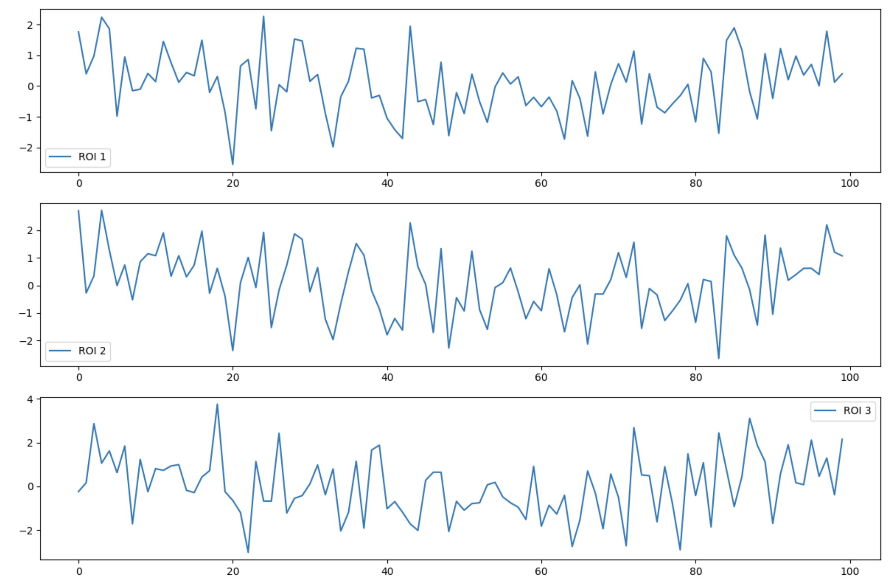
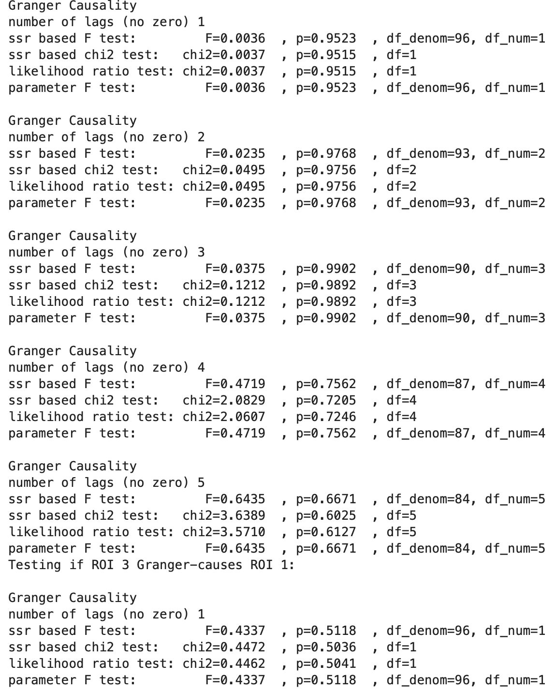
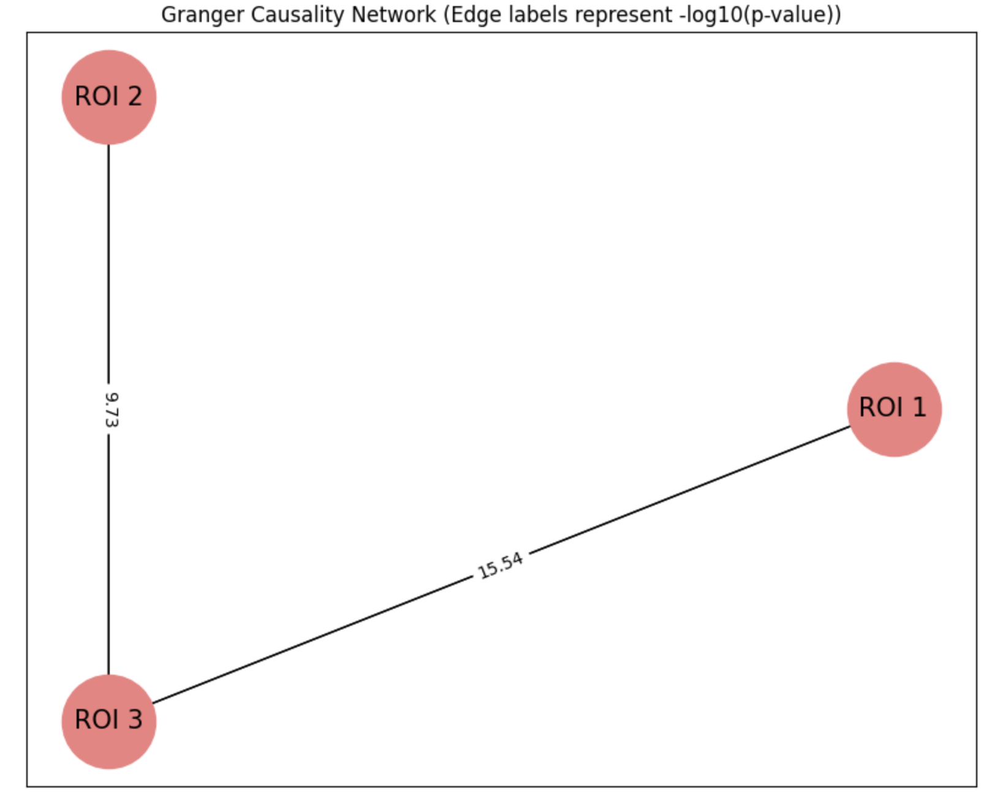
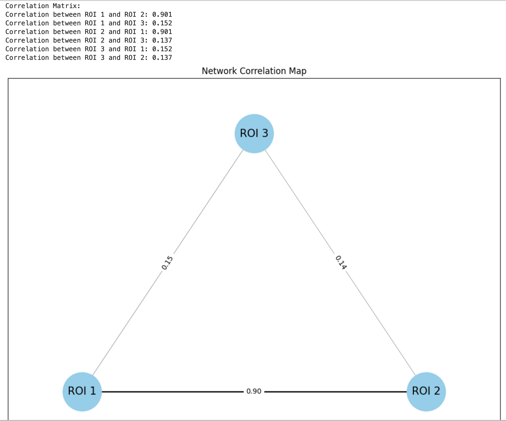

Outputs:

1- Timeseries visualisation:

2- Printed Granger Causality results (multiple lines, this is just a portion of the output):

3- Granger network graph:

4- Correlation network graph and results

## Granger Causality:

Granger causality is a statistical concept used primarily in time series analysis to determine whether one time series can predict another time series. The basic idea is as follows: If time series X Granger-causes time series Y, then past values of X should contain information that helps predict Y, above and beyond the information contained in past values of Y alone.

In a bivariate context, consider two time series, X and Y. If incorporating lagged values of X into an autoregressive model of Y improves the prediction of Y, then we might infer that X has a Granger-causal effect on Y. However, it is imperative to understand that the term "Granger causality" does not imply true causality in the philosophical or mechanistic sense. Instead, it's a method for understanding the predictive relationship between two time series.

The primary tool for determining Granger causality is the F-test. The null hypothesis for this test is that the coefficients of the lagged values of X are zero (i.e., X does not Granger-cause Y). If the null hypothesis is rejected, it provides evidence in favor of Granger causality.

The differentiation between "Granger-causes" and "causes" is crucial in time series analysis, especially when discussing Granger causality. Here's why:

    Traditional causality in scientific experiments often involves manipulating one variable to observe a change in another variable. For example, if increasing the dose of a drug results in improved health outcomes, we might conclude that the drug "causes" the health improvement.
    Granger causality doesn't deal with this type of cause-and-effect relationship. Instead, it asks: does knowing the past of one time series (X) help predict another time series (Y) better than just knowing the past of Y itself? If the answer is yes, then X is said to "Granger-cause" Y. It's purely a predictive relationship based on time-lagged information.
    The term "Granger-causality" is designed to prevent confusion. Saying that X "causes" Y might lead someone to believe there's a direct, mechanistic relationship when, in fact, all that's been identified is a time-lagged predictive relationship.Traditional causality has deep philosophical implications about the nature of cause and effect. Granger causality doesn't engage with these philosophical questions; it's purely a statistical measure.

## Description of the Code:
# Library Imports:
    numpy: For numerical operations.
    matplotlib.pyplot: For plotting time series data.
    statsmodels.tsa.stattools: Importing `grangercausalitytests` function for performing Granger causality tests.
    seaborn: A plotting library based on matplotlib.
    networkx: For visualization of networks.

# Data Generation:
    -Three regions of interest (ROIs) are simulated:
        - roi1: Random noise.
        - roi2: Based on roi1 with additional noise.
        - roi3: A shifted version of roi1 with added noise.
   

# Granger Causality Testing:
    - For each pair of ROIs, the Granger causality test is performed to check if one Granger-causes the other.
    - The minimum p-value across all tested lags is recorded for each pair.

# Visualisation of Granger Causality Results:
    - A directed graph (gc_graph) is created to represent Granger causality relationships between ROIs.
    - An edge is added from ROI X to ROI Y if X Granger-causes Y (based on a significance threshold).
# Correlation Matrix:
    - Pearson correlation is computed between the time series of every pair of ROIs.

# Visualisation of the Correlation Matrix:
    - An undirected graph (graph) is created to represent the correlations between ROIs.
    - An edge between two ROIs represents a significant correlation, with the edge's width proportional to the strength of the correlation.

This code simulates time series data for three ROIs, then it analyzes and visualizes both the Granger-causal relationships and the correlations between the time series of these ROIs:

